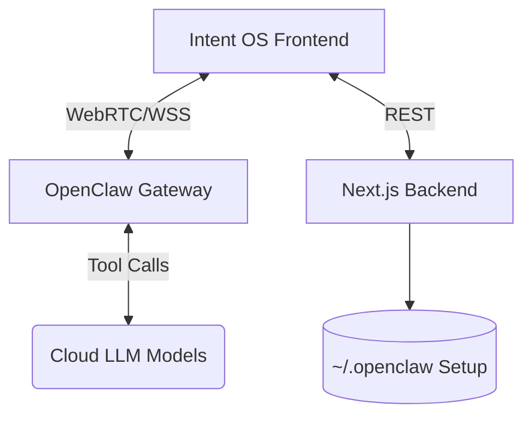

# Intent OS

Intent OS is an experimental **Intent-Driven AI Operating System** designed to demonstrate that traditional app menus are dead. Instead of navigating through screens, the user speaks or types a command, an LLM parses the intent, triggers a developer-defined tool, and the frontend dynamically generates an **ephemeral UI widget** specific to that exact task.

This repository serves as a powerful framework for developers. You can smoothly build and plug in your own custom React Native tools/apps, and the Intent OS AI will automatically orchestrate them on demand.

 *(Note: add a real screenshot here later!)*

## 🌟 Core Features

- **Generative UI Engine**: Automatically maps backend AI tool calls (e.g., `order_ride`, `fetch_weather`) directly to custom React Native boundary components. The UI is completely blank until an intent is spoken.
- **Developer-Friendly Extensibility**: Devs can seamlessly add new tools. Just define a Zod schema for your tool in the OpenClaw gateway, build a matching React `.tsx` widget in the `/mobile` app, and Intent OS handles the rest—parsing the user's intent, extracting arguments, and rendering your UI dynamically.
- **Swiss Typography Design Language**: A minimalist, high-contrast, functional UI supporting dynamic Light and Dark modes. No tab bars, no hamburger menus.
- **Realtime Voice Interactions**: Talk directly to the AI agent using the unified `VoiceOrb`. It features visual indicators for 'listening', 'thinking', and 'speaking' states.
- **Cross-Channel Global Sync**: An `activity.feed` interceptor broadcasts all agent activities across all connected devices in real-time. If you ask an agent via Discord or Terminal, your Intent OS tablet dashboard will immediately register a "WORKING..." activity pill and display the results.
- **Local-First Identity Configuration**: Connects directly to the `~/.openclaw` directory, allowing users to safely manage API keys for (OpenAI, Anthropic, Google Gemini, Groq) and edit their agent's `SOUL.md` system prompt via the browser.

## 🏗️ Architecture

The project consists of three primary layers:

1. **Mobile / Web Frontend (`/mobile`)**: A React Native (Expo) application serving as the presentation layer. It communicates with the local Gateway via WebRTC/WebSockets and the Next.js backend via REST.
2. **Next.js Backend (`/backend`)**: Handles local authentication checks, routing, fallback LLM text chatting, and safely proxying credentials to the `.openclaw` directory. 
3. **OpenClaw Gateway (`/openclaw`)**: The autonomous backend engine handling local agent context, executing tools safely, and bridging the live Voice/Text web streams.



## 🚀 Quickstart

1. Clone the repository.
2. Run `npm install` inside `/backend`, `/mobile`, and `/openclaw`.
3. Generate your secure static token and place it in the `.env.local` files for both the mobile and backend directories (`EXPO_PUBLIC_INTENT_OS_SECRET`).
4. Boot the gateway:
   ```bash
   cd openclaw
   OPENCLAW_GATEWAY_TOKEN="your_secret_here" node src/gateway/cli.js agent start
   ```
5. Boot the backend and mobile server:
   ```bash
   cd backend && npm run dev
   cd mobile && npx expo start --web
   ```

## 🗺️ Future Work Roadmap

- **Multi-Modal Awareness**: Enhancing the `VoiceOrb` to also process raw video/screen-feed inputs from the device natively.
- **Dynamic Tool Registry UI**: Allow users to drag-and-drop or code new agent tools (TypeScript functions) directly within the Settings Panel.
- **Local LLM Execution**: Integrate Ollama directly alongside the gateway so Intent OS can fallback to a fully local model (e.g., Llama 3) when off-grid.
- **Persistent Conversational Memory**: Currently, the context is ephemeral per session. Implementing a local SQLite DB for semantic recall across sessions.

---
*Built as a secure, personal AI orchestration layer.*
